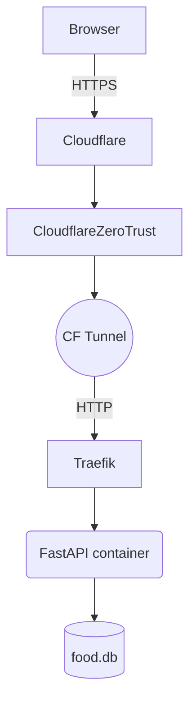

# Plan for food.ashukla.co  
A minimal restaurant‐scoring webapp backed by SQLite and served behind Cloudflare Zero-Trust.

---
## 1. Requirements Recap
1. Simple web page with a form collecting:
   - Restaurant name (text)
   - Google Maps link (URL)
   - Date visited (default = today)
   - Mood (slider, default 1.0, range 0.9-1.1 in 0.1 steps)
   - Taste (0-10 int)
   - Experience (0-10 int)
   - Value (0-10 int)
   - Notes (short paragraph)
2. Final score = `(taste + experience + value) / mood` (computed client-side).
3. Store each submission as a row in a SQLite database.
4. Accessible at `food.ashukla.co` after Cloudflare Zero-Trust authentication.
5. Possible future read-only integration with the existing Next.js blog (`ashukla.co`).
6. Ultra-low scale: max **2 users** and **≈200 rows** expected over the next two years.
7. Expose a simple **read-only JSON API** endpoint so the blog can fetch scores without any extra infra.

---
## 2. Technology Choices
| Layer | Choice | Rationale |
|-------|--------|-----------|
| Backend | **FastAPI** (Python 3.11) | Lightweight, async, easy form & API handling, automatic docs, works well with SQLite via SQLModel. |
| Database | **SQLite** (local file `food.db`) | Zero-cost, single-file, robust for personal use; easy to query/read-only from other apps. |
| ORM | **SQLModel** | Modern Pydantic + SQLAlchemy wrapper; generates models + migrations easily. |
| Front-end | **HTMX + Tailwind CSS** | Pure HTML enhanced by HTMX for dynamic form submission—no build step, tiny payload. |
| Deployment | **Docker Compose** on local **mini-PC** + **Cloudflare Tunnel** | Avoids Vercel storage limits & cost. Container ensures repeatable environment; Cloudflare Tunnel exposes port securely over HTTPS without opening inbound firewall. |
| Future Data Sharing | **Turso/libSQL read-replica** or direct SQLite read-only mount to Next.js via edge function | Allows blog to query scores later without blocking current scope. |

---
## 3. System Architecture

Notes:
- *Traefik* (or Caddy) reverse-proxy inside the mini-PC handles TLS termination from CF Tunnel.
- CF Tunnel maps `food.ashukla.co` → `localhost:8000`.

---
## 4. Data Model (SQLModel)
```python
class ScoreEntry(SQLModel, table=True):
    id: Optional[int] = Field(default=None, primary_key=True)
    restaurant_name: str
    gmaps_link: str
    date_visited: date
    mood: float = 1.0  # 0.9‒1.1 step 0.1
    taste: int  # 0‒10
    experience: int  # 0‒10
    value: int  # 0‒10
    notes: str | None = None
    final_score: float
```
`final_score` is computed in POST handler before insert.

---
## 5. FastAPI Endpoints
| Method | Path | Purpose |
|--------|------|---------|
| GET    | `/` | Serve HTML form (Jinja2 template). |
| POST   | `/submit` | Accept form data → compute `final_score` → insert row. |
| GET    | `/entries` | List recent entries (JSON); unauthenticated for blog fetch, or restrict via CF rule. |

---
## 6. UI/UX Notes
1. Tailwind CDN for styling (no build step).
2. `<input type="date">` pre-populated with today.
3. Mood slider shown with value label (HTMX update oninput).
4. Show computed final score live in the form (optional, JS).
5. After submit display toast "Saved!" and clear form.

---
## 7. Local Development Steps
1. `python -m venv .venv && source .venv/bin/activate`  
2. `pip install fastapi uvicorn[standard] sqlmodel jinja2 python-multipart`  
3. `uvicorn app.main:app --reload --port 8000`  
4. Open `http://localhost:8000`.

---
## 8. Containerisation
`Dockerfile`:
```dockerfile
FROM python:3.11-slim
WORKDIR /app
COPY requirements.txt .
RUN pip install -r requirements.txt
COPY . .
CMD ["uvicorn", "app.main:app", "--host", "0.0.0.0", "--port", "8000"]
```
`docker-compose.yml`:
```yaml
services:
  web:
    build: .
    ports:
      - "8000:8000"
    volumes:
      - ./data:/data  # SQLite persistence
    restart: unless-stopped
```

---
## 9. Cloudflare & DNS
1. In Cloudflare dashboard create **CNAME** `food` → `target.tunnelid.cfargotunnel.com` (auto-generated by Tunnel).
2. `cloudflared tunnel create food-app`.
3. `cloudflared tunnel route dns food-app food.ashukla.co`.
4. `cloudflared tunnel run --config ./cloudflared.yml` (systemd service).
5. Configure Zero-Trust Access policy to restrict to your email/OTP.

---
## 10. Reverse Proxy (optional)
If multiple apps on the mini-PC, place **Traefik** in front:
- Traefik listens on :80/:443 with Let’s Encrypt.
- CF Tunnel forwards to Traefik.
- Traefik routes `Host(food.ashukla.co)` → `web:8000`.

For single-app setup you can skip Traefik and expose FastAPI directly.

---
## 11. Backup Strategy
- Daily cron job to copy `/data/food.db` → cloud storage (e.g., Backblaze B2, Dropbox).
- Keep 7-day rolling backups.

---
## 12. Future Integration with Next.js Blog
1. Mount or replicate `food.db` to Vercel at build time (read-only) or
2. Expose read-only JSON API `/entries` and consume via `getStaticProps` in blog.

---
## 13. Timeline
| Day | Task |
|-----|------|
| 1   | Scaffold FastAPI app, create data model, local form, save to SQLite. |
| 2   | Polish UI with Tailwind, add HTMX interactivity. |
| 3   | Dockerise, test locally. |
| 4   | Set up Cloudflare Tunnel & DNS. |
| 5   | Deploy on mini-PC, configure backups. |

---
## 14. Done!
You can now log scores at `food.ashukla.co` from your phone. 

---
## 15. Example implementation for `/entries`:
```python
from sqlmodel import Session, select

@app.get("/entries", response_model=list[ScoreEntry])
def list_entries(limit: int = 100):
    with Session(engine) as session:
        return session.exec(
            select(ScoreEntry)
            .order_by(ScoreEntry.date_visited.desc())
            .limit(limit)
        ).all()
```
This keeps the API tiny while giving your blog an easy endpoint to consume via `fetch()` or `getStaticProps`. 